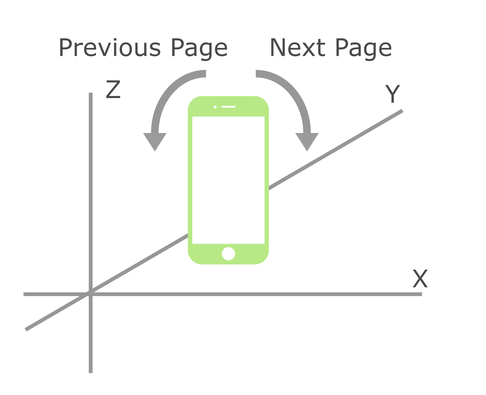

<h1 style="text-align:center">Control Presentation</h1>

You can use several types of input to control your presentation.

- Clicking on left/right half of window.
- Pressing Left/Right Arrow keyboard.
- Pressing Prev/Next Buttons on control pain hidden below.
- Using **Gyro**

